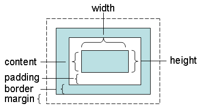

| <a href="../estilizando-o-texto-do-documento/">artigo anterior</a> | <a href="../">index</a> |

Para alterar o dimensionamento de um elmento utilizamos `height` e `widht` para altura e largura respectivamente.

Devemos utilizar as unidades de medias, mas eu não quero entrar neste assunto agora, por hora basta saber que temos:

- __px__ (pixels) medida absoluta
- __%__ (porcentagem) medida relativa
- __em__ (pixels) medida relativa baseado no tamanho de fonte

Podemos alterar a margem de um elemento com a propriedade `margin`, veja este artigo para saber mais sobre  
[a proriedade margin](../margin/).

<!--
Podemos alterar o espaçamento de um elemento com a propriedade `padding`, veja este artigo para saber mais sobre  
a proriedade padding../padding/)
-->

Podemos alterar a borda de um elemento com a propriedade `border-style`, veja este artigo para saber mais sobre  
[a proriedade border-style](../border-style/)

Como __exercício__, tente alterar o estilo desta página (use o plugin do navegador) explorando as propriedades acima apresentadas.

<!--
## Pronto para o teste ?

Agora você chegou ao fim dessa série introdutória sobre CSS eu gostaria de desafiá-lo a realizar nosso teste.

Tem corajem ? Então, [faça o teste](../teste-seu-conhecimento-sobre-css-01/)
-->