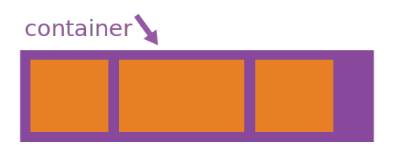
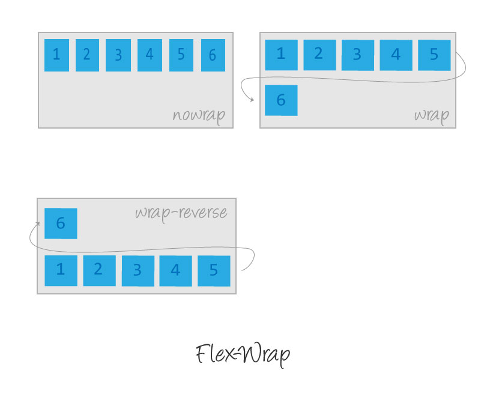
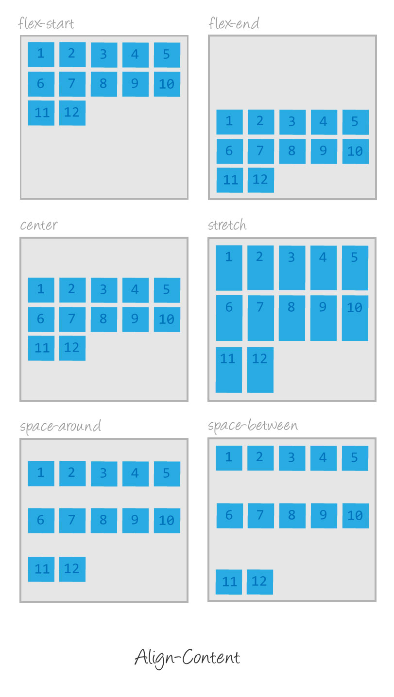

Neste artigo...

- [flex-direction](#flex-direction)
- [justify-content](#justify-content)
- [align-items](#align-items)
- [flex-wrap](#flex-wrap)
- [align-content](#align-content)

## flex-direction

    flex-direction: row (default) | row-reverse | column | column-reverse

Neste exemplo já podemos testar a propriedade `flex-direction`. Ele é simples porque ou você dispõem as boxes como linha
 ou dispõem como coluna.

1. Abra o exemplo 3 e altere a propriedade `flex-direction`.
2. Entendeu a questão do `reverse` ?

A propriedade `flex-direction` define a direção dos flex itens, ela altera o eixo do container.

Veja [demo](01.html).

## justify-content

    justify-content: flex-start (default) | flex-end | center | space-around | space-between

Essa propriedade alinha os itens conforme o eixo, ou melhor, conforme o valor de `flex-direction`.

1. Sendo `flex-direction: row`, experimente todos os valores.
2. Sendo `flex-direction: column`, experimente todos os valores.

Para ficar ligado nas novidades dessa propriedade acesse a
[documentação da mozilla](https://developer.mozilla.org/pt-BR/docs/Web/CSS/justify-content). Repare que temos propriedades
não comentadas aqui, como por exemplo `space-evenly`, `start baseline`, etc...

Veja [demo](02.html).

## align-items

    align-items: stretch (default) | baseline | center | flex-start | flex-end

Agora vamos testar a propriedade `align-items`.

Ela pode alinhar as boxes no início (`flex-start`), no final (`flex-end`) e no centro (`center`). Parecido com a
propriedade anterior (justify-content) você não acha ?

O baseline costuma causar alguma dúvida, falaremos dele futuramente.

1. Sendo `flex-direction: row`, experimente todos os valores.
2. Sendo `flex-direction: column`, experimente todos os valores.
3. Brinque juntamente com a propriedade `justify-content`.
4. O que acontece se __justify-content: center__ e __justify-content: align-items__ ?
5. Aumente e diminua a tela e repare no comportamento.
6. Você notou que eu comentei a linha `width: 50px` ?
7. ...era para você perceber que o item ucupava o espaço todo (100%).

<!--[developer.mozilla.org/align-items](https://developer.mozilla.org/en-US/docs/Web/CSS/align-items)-->

Veja [demo](03.html).

## flex-wrap

    flex-wrap: nowrap (default) | wrap | wrap-reverse

Indica se quebra ou não a linha. Ao diminuir a tela (ou o tamanho de sua div container) os itens irão cair para a próxima
linha.

1. Abra o exemplo mas não mexa no código, ainda.
2. Agora, diminua a sua tela e observe o comportamento atentamente.
3. O __wrap__ também funciona com __flex-direction: column__...
4. ...só que você terá que mudar a altura de sua div.

Veja [demo](04.html).

## align-content

Escrever aqui alguma coisa.

Veja [demo](05.html).

