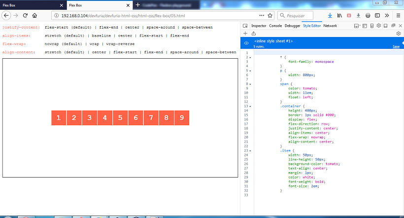

Eu preparei um tutorial bem legal para você aprender sobre Flex Box.

Mas não é para ficar só na leitura, precisa colocar a mão na massa. É isso que eu proponho!

Você precisa ver a coisa funcionando! Se não, não vai absorver o conhecimento.

Eu preparei cada exemplo com o maior caprinho, cabe a você se exercirtar em cada um deles. Vá item a item: lendo e
colocando em prática, lendo e colocando em prática, lendo e colocando em prática, etc...

## O que eu espero que você faça

Você deve abrir o navegador e acionar a tecla F12 (abrir a ferramenta de desenvolvedor).

Normalmente a janela de desenvolvimento se acomoda no rodapé. Sugiro que você disponha ela no canto direito da tela
(eu tive o cuidado de preparar os exemplos pensando nessa disposição).

Estou utilizando o FireFox, mas tudo bem se você preferir o Chrome, apenas tenha a certeza de poder alterar a folha de
estilos conforme imagem abaixo.

Fique com as duas abas abertas, porque eu enumerei os exemplos, é só ir trocando os números.

## Uma introdução ao flex box

Introduzir o Flex Box, o que é, para que serve, onde estamos!

## A ordem natural dos elementos

Se colocarmos 3 div´s em sequência, qual será a sua disposição na página ?

Esse primeiro passo é só para lembrar, caso tenha esquecido, do fluxo normal de um elemento de bloco.

1. Abra o primeiro exemplo na aba do lado, abra a ferramenta de desenvolvedor (F12).
2. Analise o css e tenha a certeza de que entendeu nosso css inicial.
3. Aproveite agora para entender o HTML, veja como estruturamos o documento.

Veja [primeiro exemplo](01.html).

## Display

    display: flex | inline-flex

No segundo exemplo eu inclui a propriedade `display: flex`, ela é nosso ponto inicial.

Reparou como as divs se comportaram ? Vai lá mano(a), faz o exercício. Se não, você não vai aprender não.

Eu deixei um pequeno span antes de nossa div principal (veja o html). Ela serve para testarmos a diferênça entre os
valores `flex` e `inline-flex`.

1. Abra o exemplo 2 e altere a propriedade `display`, experimente `flex`, `inline-flex`, `block` (padrão) e `inline`.
2. Entendeu a diferença entre `flex` e `inline-flex` ?

A propriedade torna o elemento em um flex container, transformando todos os seus filhos diretos em flex itens.

Veja [segundo exemplo](02.html).

## Na sequência...

Agora você está pronto.

<a target="_blank" class="btn btn-primary btn-lg" style="width: 300px;" href="../flex-box-containers/">Flex Box - containers</a>

<a target="_blank" class="btn btn-primary btn-lg" style="width: 300px;" href="../flex-box-items/">Flex Box - items</a>

## Além do devfuria...

Haaa sim! Você precisará ir além do devfuria.

- [developer.mozilla.org - CSS Flexible Box Layout](https://developer.mozilla.org/en-US/docs/Web/CSS/CSS_Flexible_Box_Layout)
