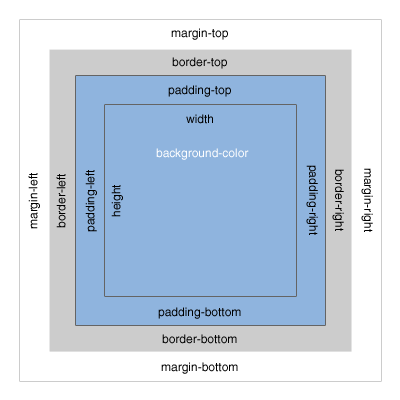

O modelo de caixa (box model) é um conceito de caixa. Depois de ler este artigo e praticar os exercícios você deverá
compreender o funcionamento das propriedades `margin` e `padding`.





Vamos utilizar a marcação abaixo. Nós temos um div dentro da outra e um parágrafo só para ilustrar o conteúdo.

```html
<div class="externo">
    <div class="interno">
        <p>Eu sou o oconteúdo!</p>
    </div>
</div>
```

<div class="externo">
    <div class="interno">
        <p>Eu sou o oconteúdo!</p>
    </div>
</div>


## Passo 1

Podemos aplicar uma borda preta na div externa.

```css
.externo {
    border: 1px solid black;
}
```

<div class="externo1">
    <div class="interno1">
        <p>Eu sou o oconteúdo!</p>
    </div>
</div>
<style>
.externo1 {
    border: 1px solid black;
}
.interno1 {
}
</style>


## Passo 2

E agora uma borda vermelha para a div interna.

```css
.interno {
    border: 1px solid red;
}
```

<div class="externo2">
    <div class="interno2">
        <p>Eu sou o oconteúdo!</p>
    </div>
</div>
<style>
.externo2 {
    border: 1px solid black;
}
.interno2 {
    border: 1px solid red;
}
</style>

De tão próximo, as cores resultam num efeito interessante (ou esquisito).


## Passo 3

Então vamos dar um espaçamento ? Podemos dar um `padding` de `10px` em cada lado.

```css
.interno {
    border: 1px solid red;
    padding: 10px 10px; /* atenção */
}
```

<div class="externo3">
    <div class="interno3">
        <p>Eu sou o oconteúdo!</p>
    </div>
</div>
<style>
.externo3 {
    border: 1px solid black;
}
.interno3 {
    border: 1px solid red;
    padding: 10px 10px;
}
</style>

Bom, o conteúdo parece que ocupou mais espaço, não é mesmo ?

E as bordas continuam com aquele efeito engraçado.


## Passo 4

Então vamos aplicar `10px` no 4 cantos da margem da div interior.

```css
.interno {
    border: 1px solid red;
    padding: 10px 10px;
    margin: 10px 10px; /* atenção */
}
```

<div class="externo4">
    <div class="interno4">
        <p>Eu sou o oconteúdo!</p>
    </div>
</div>
<style>
.externo4 {
    border: 1px solid black;
}
.interno4 {
    border: 1px solid red;
    padding: 10px 10px;
    margin: 10px 10px;
}
</style>

Demos um respiro e, dessa forma, as bordas parecem fazer mais sentido.

O que você achou ?


## Passo 5 (último)

Para terminar vamos aplicar uma cor da background.

```css
.interno {
    border: 1px solid red;
    padding: 10px 10px;
    margin: 10px 10px;
    background-color: orange; /* atenção */
}
```

<div class="externo5">
    <div class="interno5">
        <p>Eu sou o oconteúdo!</p>
    </div>
</div>
<style>
.externo5 {
    border: 1px solid black;
}
.interno5 {
    border: 1px solid red;
    padding: 10px 10px;
    margin: 10px 10px;
    background-color: orange;
}
</style>


## Exercícios

1. Abra o [exercício](exercicio.html) e aplique cada passo apresentado neste artigo.
2. Veja na web [imagens ilustrando o box model](https://www.google.com.br/search?q=css+box+model&num=100&source=lnms&tbm=isch&sa=X&ved=0ahUKEwioi_HwxZPYAhWJIZAKHTRVCYAQ_AUICigB&biw=1366&bih=677).