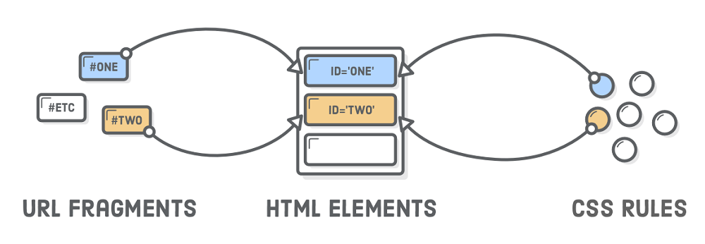

Neste artigo:

- [Seletor de tipo (tag)](#seletor-de-tipo-tag)
- [Combinadores](#combinadores)
- [Seletor de Identificação (id)](#seletor-de-identificação-id)
- [Seletor de classe](#seletor-de-classe)
- [Pseudoclasse](#pseudoclasse)
- [Seletor Universal](#seletor-universal)
- [Seletor de atributo](#seletor-de-atributo)


## Seletor de tipo (tag)

Deveria se chamar seletor de tag, pois o "tipo" refere-se a tag HTML.

É o seletor mais abrangente da CSS, ele casa com todos os elementos encontrados.

Os estilos abaixo irão refletir em todos o elementos `p` e `h1` da página.

```css
h1 {
    font-size: 20px;
}
p {
    font-size: 10px;
}
```

E se você quise-se utilizar uma mesma regra para um determinado grupo de tags HTML ?

Você poderia utilizar o __agrupamento de seletores__. Para aplicar uma regra CSS comum a vários seletores você pode
 agrupá-los. Abaixo vemos algumas regras em comum...

```css
h1 {color: red;}
h2 {color: red;}
p {color: red;}
```

...aqui elas foram agrupadas:

```css
h1, h2, p {color: red;}
```


## Combinadores

Quando você quer atingir um elemento filho ao invés do elemento principal (pai) os combinadores irão ajudar você.

Temos 4 tipos de combinadores.

- descendentes
- filho
- irmão adjacente
- irmão geral

Para entender bem essa questão você precisar ter conhecimento da árvore do documento (DOM). Mas acho que dá para seguirmos
de qualquer forma.

Seletor descendente

```css
ul li {}
```

Seletor filho

```css
ul > li {}
```

Irmão adjacente

```css
ul + li {}
```

Irmão geral

```css
ul ~ li {}
```


## Seletor de Identificação (id)

O identificador `id` pode ser aplicado a maioria dos elementos HTML só que ele deve ser único em sua página.

```html
<div id="main">...</div>
```

A CSS deve ser precedidada pelo sinal `#` e imediatamente seguida pelo nome, veja:

```css
#main {
}
```


## Seletor de classe

Podemos aplicar o seletor ao atributo `class` de qualquer elemento HTML.

Se a intenção é aplicar a mesma regra CSS a diferentes elementos, você pode utilizar um __seletor de classe__, segue
exemplo:

```html
<p class="diferente">Este parágrafo sairá diferente por causa da estilização</p>
```

A CSS deve começar com um `.` (ponto) imediatamente seguido pelo nome da classe, veja:

```css
.diferente {
    color: black;
}
```


## Pseudoclasses

Pseudoclasses indicam os estados de elementos, mas espera aí um pouco! "Pseudo" é um prefixo utilizado na língua
portuguesa para indicar um teor falso cujo conteúdo não é real ou verdadeiro. Então é uma classe falsa ?

As pseudoclasses mais utilizadas foram as do elemento âncora (`<a href="">link</a>`). São elas:

- :link    = quando o link ainda não foi visitado
- :visited = quando o link já foi visitado
- :hover   = quando o ponteiro do mouse passa sobre sua área
- :active  = quanto o link é ativado (ao clicar do mouse)

```css
a:link {}
a:visited {}
a:hover {}
a:active {}
```


## Seletor Universal

Você deseja estilizar TODOS os elementos em uma página, o seletor universal resolve essa questão.

Atua como um coringa, atinge todos os elementos disponíveis.

Normalmente utilizado para resetar (zerar) algumas propriedades que vem como pedrão nos navegadores, veja exemplo:

```css
* {
  padding: 0;
  margin: 0;
}
```

Nos navegadores mais antigos ele nem sempre funcionava (pra variar). É comum vermos algumas variações como mostrado
abaixo:

```css
*, html {}
html, body {}
```


## Seletor de atributo

Permite selecinoar um elemento com base na existência de um atributo ou valor do atributo.

Exemplo, atingir todos os elementos `li` que possuam o atributo `disable`:

```css
li[disabled] {

}
```

Exemplo, seleciona todos os elementos do tipo "button":

```css
[type='button'] {

}
```
